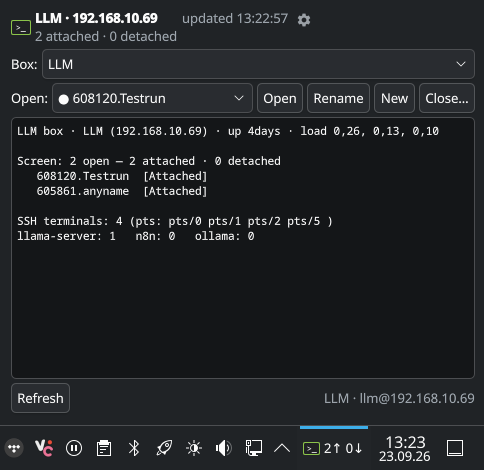
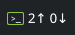

# Terminal Sessions for Idiots (TSfI)

<p align="center">
   

  <br>
  
</p>


TSfI keeps your remote terminal sessions within reach. It is a KDE Plasma 6
panel widget that shows what is running on remote computers and lets you jump
into it from Konsole. Each connection has an **engine**:

- **GNU Screen** - classic detached sessions (`screen -ls`, `screen -dr`/`-x`): list them, open one, start a new one, rename, or close with confirmation.
- **Herdr** - panes and tabs over Herdr's socket API: see how many panes/tabs/workspaces are open and attach the box's Herdr TUI in a Konsole tab.

## What you can do

- Check the panel badge: for a Screen box it shows attached/detached sessions; for a Herdr box it shows open panes. Green means something is running, amber means reachable but empty, red means unreachable.
- See each computer's uptime, total CPU usage across all cores, and used/total RAM in the popup. CPU is sampled over 0.2 seconds; RAM counts reclaimable cache as available. Remote figures come from Linux's built-in `/proc` files over the existing SSH connection, without installing another service.
- Click the badge for details.
- Screen boxes: pick a session and open it in Konsole, or start/rename/close sessions.
- Herdr boxes: see a live pane/tab/workspace count and open the Herdr TUI on the box.
- Local Herdr: point a connection at `local` to watch and attach the Herdr server running on this PC (no SSH).
- Add multiple remote computers and switch between them from the popup.
- Set the refresh interval, the attach mode (Screen only), and the engine per box.

TSfI talks to each computer over SSH. It is read-only against the box until
you explicitly run an action. If a computer is offline, the widget cannot
manage its sessions.

## Before you start

You need KDE Plasma 6 and Konsole on your desktop. On each remote computer you
need SSH access; GNU Screen for Screen boxes, and Herdr for Herdr boxes. To
watch Herdr *on this very PC*, Herdr also has to be installed and its server
running here (use the gear's "This PC (local Herdr)" checkbox).
Set up SSH key authentication so `ssh user@your-host screen -ls` (or
`herdr pane list`) works without a password prompt before installing.

## Install

From a checkout of this repository, run:

```bash
kpackagetool6 -t Plasma/Applet -i plasmoid/org.d.llmsessions
```

Then right-click your panel, choose **Add Widgets**, and add **Terminal
Sessions for Idiots**. Open the widget's gear button to set up a connection.
The widget bundles the scripts it needs; installing them separately is
optional.

To update an existing installation after pulling changes:

```bash
kpackagetool6 -t Plasma/Applet -u plasmoid/org.d.llmsessions
```

To remove it, use `kpackagetool6 -t Plasma/Applet -r org.d.llmsessions`. The
widget's internal ID (`org.d.llmsessions`) stays the same so existing panel
placements and configuration continue to work across renames.

## Using the widget

Select a computer in the **Box** menu.

- **Screen box**: choose a session in **Open** and attach it in Konsole.
  **New** starts another session, **Rename** changes its name, **Close**
  ends it after asking for confirmation.
- **Herdr box**: the popup shows the pane/tab/workspace count. **Open
  Herdr** starts `ssh -t user@box herdr` in a Konsole tab so you land in
  the box's Herdr TUI with its panes and tabs.
- **Local Herdr**: create a connection with the "This PC (local Herdr)"
  checkbox in the gear; it sets the host to `local`. The widget then talks
  to this PC's own Herdr server directly (badge = local panes) and **Open
  Herdr** opens the local TUI.

**Refresh** checks for changes immediately.

In the gear settings, per connection choose an **Engine** (GNU Screen or
Herdr) and, for Screen, an attach mode:

- **Detach and pull here** (`screen -dr`): takes over the session from another terminal.
- **Share** (`screen -x`): opens the same session without detaching it elsewhere.

Closing a Screen session also stops programs running inside it. Check which
session you selected first.

## Configuration and command-line helpers

The widget stores its settings in `~/.config/llmsessions/box.conf`. You can
manage connections from the gear button; the file is shared with the optional
command-line helpers. The existing config path and `llm-` helper names are
retained for compatibility.

```ini
POLL_SECONDS=60
ACTIVE=LLM
CONN_LLM="192.0.2.55|user|22|dr|screen"
CONN_PC1="192.0.2.56|user|22|x|herdr"
CONN_LOCAL="local|local|0|dr|herdr"
```

These are example addresses, not working servers. Each connection has a name,
host, SSH user, port, attach mode (`dr` or `x`), and engine (`screen` or
`herdr`). The engine field is optional and defaults to `screen`. The special
host `local` means the Herdr server on this PC: user/port are ignored and the
engine is forced to `herdr`, so no SSH is used. Connection names may contain
letters, numbers, underscores, and hyphens, but must start with a letter or
underscore. The config file is parsed as data, never executed as a shell
script (the `|` values must not become shell pipes).

If you want to use the helpers from a terminal, install them separately:

```bash
install -d ~/.local/bin
install -m755 scripts/* ~/.local/bin/
```

| Helper | Purpose |
|---|---|
| `llm-sessions [connection]` | Show Screen sessions or Herdr panes for a box |
| `llm-open-screen [connection] <session>` | Open a Screen session in Konsole |
| `llm-open-herdr [connection]` | Open the box's Herdr TUI in Konsole |
| `llm-open-new [connection] [name]` | Start a Screen session |
| `llm-rename <connection> <session> <new-name>` | Rename a Screen session |
| `llm-close <connection> <session>` | End a Screen session |
| `llm-config-get` | Show the current settings |
| `llm-config-apply` | Change settings from the command line |

For example, `llm-sessions PC1` lists what is open on the connection called
PC1 (its engine decides whether it reports Screen sessions or Herdr panes).
Set `LLMBOX_CONF` to use another config file, such as when testing. The
supported `llm-config-apply` operations are
`set-conn NAME HOST USER PORT MODE [--engine screen|herdr]`,
`set-active NAME`, `remove-conn NAME`, and `set-poll SECONDS`; you can
combine operations in one call. Existing connections keep their engine when
`--engine` is omitted; new connections default to GNU Screen.

## Notes

The widget is packaged in `plasmoid/org.d.llmsessions/`. The top-level
`scripts/` directory contains optional CLI copies of the same scripts bundled
with the widget. Development notes and Plasma/Plasmoid troubleshooting live in
[`docs/PROBLEMS-FINDINGS.md`](docs/PROBLEMS-FINDINGS.md).

Licensed under GPL-2.0-or-later. This thing is 100% Vibecoded btw
